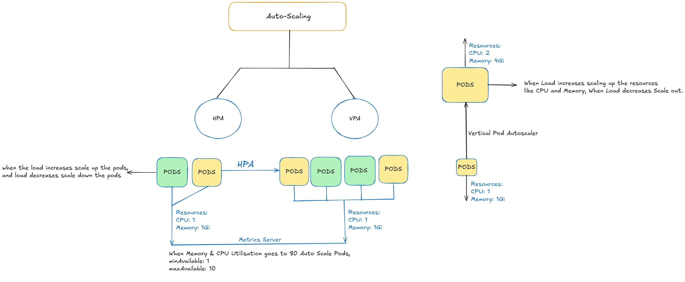
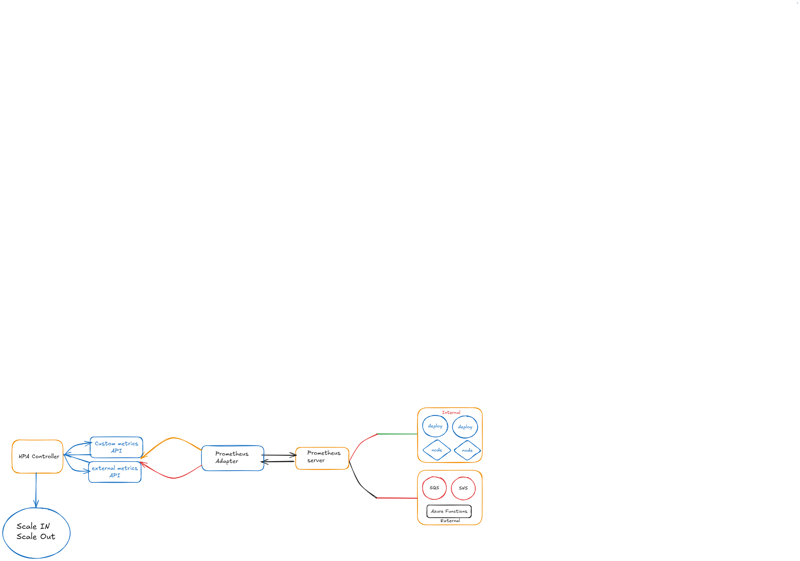

About AutoScaling:

Horizantal Pod Autoscaler:

1) Pre-requisite is Metrics server.

   Download Metrics Server from this URL:
   kubectl apply -f https://github.com/kubernetes-sigs/metrics-server/releases/latest/download/components.yaml

   Basically, metrics server observes the metrics of pod which is like CPU and Memory.

2) check utilisation as 15s interval.
3) can be used for deployments and statefulsets.
4) It Automatically scales number of pods based on CPU and Memory Utilization.

For VPA: Vertical Pod Autoscaling:

1) git clone https://github.com/kubernetes/autoscaler.git

   cd autoscaler/vertical-pod-autoscaler
   ./hack/vpa-up.sh

   kubectl get pods -n kube-system | grep vpa
   you should see:

   vpa-admission-controller
   vpa-recommender
   vpa-updater

For Cluster Autoscaler :

--> Follow cluster-Autoscaler-deployment-yaml located in parentdirectory "Autoscaling"
    and has IAM-Policy json file in same parent directory

    Create a Iam-Role and attach that policy to that role and build trust relationship with OIDC of eks 
    for secure and trust connections, call you service account in trust relationship section 

    --> Annotate you service Account with created role, this gives you IRSA procedure, instead of placing plicy into node role sections. 