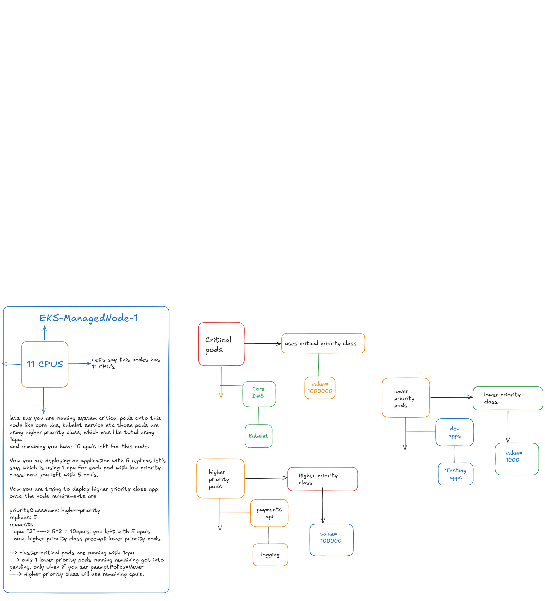

Priority Class:

What is priority class in kubernetes ?

Priority Class defines if resource like cpu and memory over used in nodes and you need to deploy your pods onto nodes in any case priority class will takes care accordingly. which means if the priorityclass has highest vlaue like 
value = 100000000 uses critical,
value = 1000000 uses high-priority
value = 1000 uses as low priority 

simply it means high value = higher chance to deploy pods onto nodes
highest priority classes will always preempt lower priority pods

if you dont set any priority class name to the pod it will takes lower priority by default.

