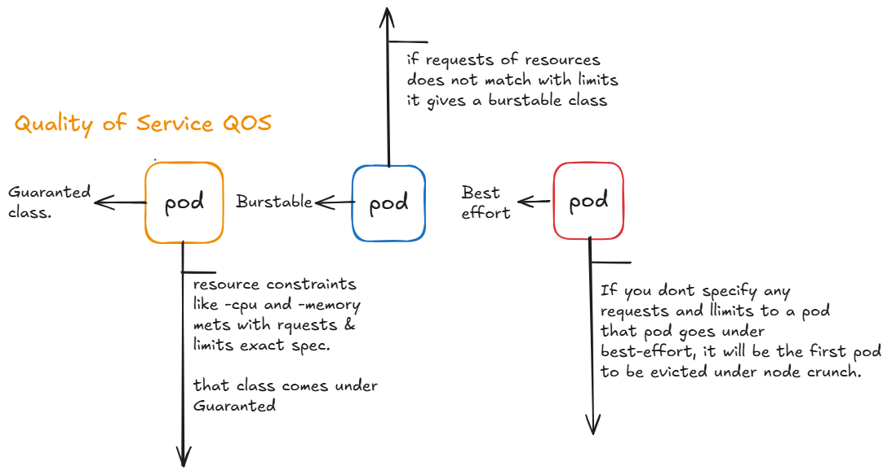

Everything about Quality of service classes: QOS

Guaranted ----> Burstable ------> Besteffort

1) Guaranted class --->
 resources:
   limits:
     memory: "128Mi"
     cpu: "500m"
   requests:
     memory: "128Mi"
     cpu: "500m" 

    If you specify limits and requests that matches exact resources, that pod can be comes under Guaranted class

2) Burstable class --->
 resources:
   limits:
     memory: "128Mi"
     cpu: "500m"
   requests:
     memory: "100Mi"
     cpu: "250m" 
   
   Your requests doesnot match with limits, it goes under burstable class

3) Besteffort class ---->

   If you dont specify any resources to pod that pod will be comes under besteffort class
   it is the only pod that will be preempted or evicted at the time of node resource crunch.
